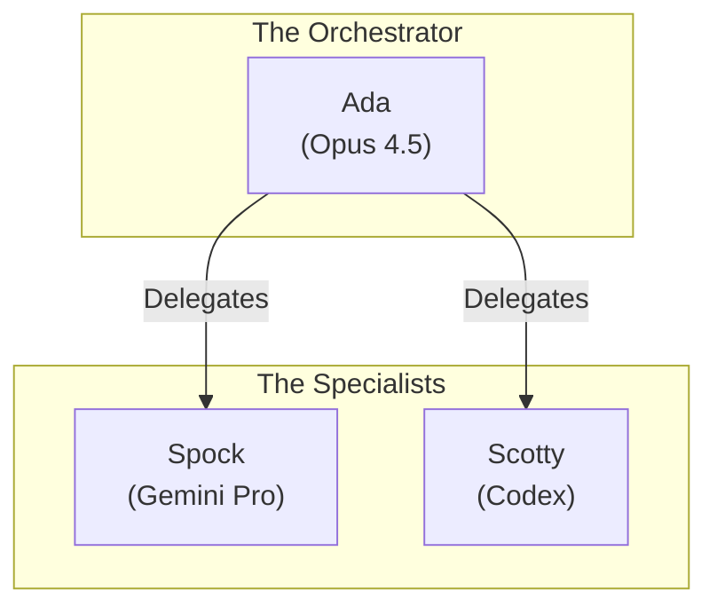

# The Enterprise Crew — Orchestrated AI Articles

Public repository for technical write-ups on our multi-agent, multi-gateway AI system running Curacel and Soteria AI.

## Contents

- **[The Manifesto](MANIFESTO.md)** — Our principles: Orchestration > Conversation, Specialization > Generalization, and why agents need real access to do real work.

- **[The Enterprise Crew](THE_ENTERPRISE_CREW.md)** — Technical deep-dive into the architecture: multi-gateway communication, model selection, tools & skills, real-world workflows, cost analysis, and 6 months of production learnings.

## Why This Repo

We're publishing these as standalone articles to share:
1. **How we actually run this in production** (not demos)
2. **Multi-gateway orchestration patterns** (ada-gateway + Pi + Mac)
3. **Real cost/benefit analysis** (~$725/month to run 3 agents 24/7)
4. **Lessons learned** (what works, what doesn't, gotchas)

This is the infrastructure managing:
- 200+ emails/week
- 10-15 PRs/week
- 40+ meetings/month (auto-documented)
- 51-person company operations
- 40+ insurance customers across Africa, Middle East, Latin America

## The Crew

| Agent | Role | Model | Location | Purpose |
|-------|------|-------|----------|---------|
| **Ada** 🔮 | Orchestrator | Claude Opus 4.5 | ada-gateway (GCP) | BD/Sales, strategy, delegation |
| **Spock** 🖖 | Research & Ops | Gemini 3 Pro | ada-gateway (GCP) | Analysis, meeting notes, action tracking |
| **Scotty** 🔧 | Builder | GPT-5.2 Codex | castlemascot-r1 (Pi) | Code, infrastructure, integrations |

## Infrastructure

- **ada-gateway** (GCP) — Main orchestration hub
- **castlemascot-r1** (Raspberry Pi 5) — Edge deployment, builds
- **MascotM3** (Mac) — Node companion, ChromaDB, Obsidian vault server

**Communication:**
- Same gateway: `sessions_send` (direct)
- Cross-gateway: Webhook bridge (Ada/Spock ↔ Scotty)

## Real-World Metrics

**Email Management:**
- 95% draft acceptance rate
- ~8 hours/week saved

**Meeting Notes:**
- Auto-posted to Slack within 5 minutes
- ~40 meetings/month documented
- 0 human seconds required

**Code Shipping:**
- 10-15 PRs/week
- ~3 minute review time
- ~5 minute deployment time

**Cost:**
- $725/month total (infrastructure + API)
- $0.80/hour effective rate (24/7 operation)
- Positive ROI vs. human time saved

## Tech Stack

**Runtime:** [Clawdbot](https://clawd.bot)  
**Messaging:** Telegram, WhatsApp, Slack  
**Email:** Gmail (domain-wide delegation)  
**Code:** GitHub, git, gh CLI  
**Meetings:** Fireflies.ai, Google Calendar  
**Search:** ChromaDB (semantic), Perplexity  
**Documents:** Google Workspace, docx/xlsx/pdf/pptx processing  
**Automation:** Cron, webhooks, n8n  

## About

We're running Curacel (insurance automation, 51 employees, $3M+ revenue) and building Soteria AI (next-gen agentic AI for financial services) with orchestrated agents as core operational infrastructure.

This isn't a side project. This is how we work.

**Built by Henry Mascot**  
Founder, Curacel & Soteria AI  
[@henrino3](https://twitter.com/henrino3)  
henry@curacel.ai

## Contributing

PRs welcome for:
- Corrections
- Improved diagrams
- Additional workflow examples
- Cost optimization tips

## Join the Community

- **Website:** [clawd.bot](https://clawd.bot)
- **Docs:** [docs.clawd.bot](https://docs.clawd.bot/start/getting-started)
- **Discord:** [Join our Discord](https://discord.com/invite/clawd)
- **Source:** [github.com/clawdbot/clawdbot](https://github.com/clawdbot/clawdbot)

---

**2026 is the year of orchestration.** Ada and her crew are already working.
